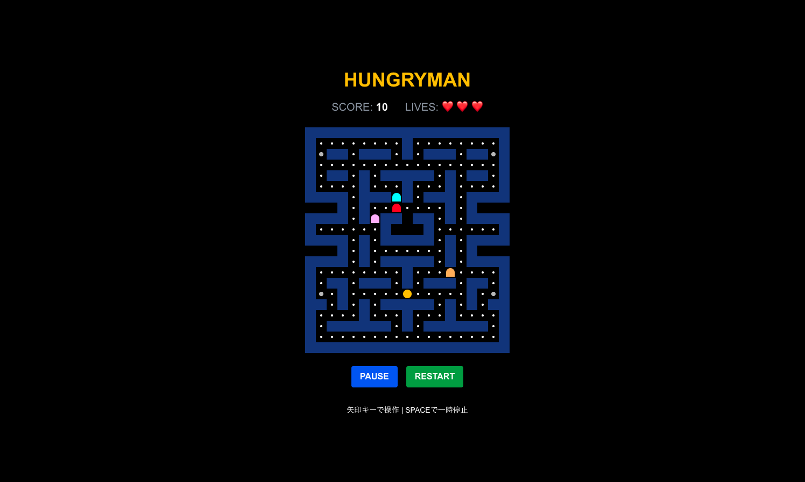

# Hungryman



## ディレクトリ構成

```
hungryman/
├── public/                     # 静的ファイル
│   ├── images/                # 画像ファイル
│   ├── next.svg              # Next.jsロゴ
│   └── vercel.svg            # Vercelロゴ
├── src/                       # ソースコード
│   ├── app/                   # App Router (Next.js 13+)
│   │   ├── globals.css       # グローバルスタイル
│   │   ├── layout.tsx        # ルートレイアウト
│   │   └── page.tsx          # ホームページ
│   ├── features/              # 機能別ディレクトリ
│   │   └── hungryman/        # Hungrymanゲーム機能
│   │       ├── Hungryman.container.tsx      # コンテナコンポーネント
│   │       ├── Hungryman.presentational.tsx # プレゼンテーショナルコンポーネント
│   │       ├── Hungryman.use.ts             # ビジネスロジック
│   │       └── components/                  # ゲーム用コンポーネント
│   │           ├── GameBoard.tsx            # ゲームボード
│   │           ├── ScoreBoard.tsx           # スコア表示
│   │           └── GameControls.tsx         # ゲーム操作
│   ├── types/                 # TypeScript型定義
│   │   └── hungryman.type.ts  # Hungryman関連の型定義
│   └── utils/                 # ヘルパー関数
│       └── constants.ts       # 定数定義
├── display-image/             # 表示用画像
│   └── display1.png          # ゲーム画面スクリーンショット
├── .eslintrc.json            # ESLint設定
├── .gitignore                # Git無視ファイル
├── next.config.ts            # Next.js設定
├── package.json              # 依存関係とスクリプト
├── postcss.config.mjs        # PostCSS設定
├── tailwind.config.ts        # Tailwind設定
└── tsconfig.json             # TypeScript設定
```

## 機能

- **Hungrymanゲーム**: パックマン風のゲーム
- **Container-Presentational パターン**: UIとロジックの明確な分離
- **TypeScript**: 型安全な開発
- **Tailwind CSS**: ユーティリティファーストなCSS

## 開発開始

```bash
npm run dev
```

http://localhost:3000 でアプリケーションが起動します。

## 操作方法

- **矢印キー**: プレイヤーの移動
- **SPACE**: ゲームの一時停止/再開
- **RESTART**: ゲームのリスタート

## 技術スタック

- **Next.js 15** (App Router)
- **TypeScript**
- **Tailwind CSS**
- **React 19**